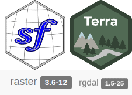

class: title-slide, left, middle
background-image: url("images/Rlogo.png")
background-position: 10% 50%
background-size: 30%
background-color: #F9F8F3

.pull-right[

# `r rmarkdown::metadata$title`
### `r rmarkdown::metadata$date`
]

---
## Introdução a linguagem R
.pull-left[
```{r R, echo=FALSE, out.width="72%", fig.align="left"}
knitr::include_graphics("images/Rlogo.png")
```
]

Código aberto

Estatística (ciência de dados) Ross Ihaka & Robert Gentleman

Colocar aqui

Outras coisas

---
## Introdução a linguagem R

#### IDES para R

```{r Rstudio, echo=FALSE, out.width="65%", fig.align="center"}
knitr::include_graphics("images/Rstudio.png")
```
---
## Instalações 
#### Windows 

1.  Acessar o site oficial [R (4.2.2)](https://www.r-project.org/). 

2. No menu à esquerda, encontre a opção Download e clique em CRAN.

3. Esoclha o servidor (mirror) mais próximo de você.

4. Clique em Download R for Windows.

5. Clique na opção `base`  ou `install R for the first time` 

6. Na nova página, clique em Download R x.x.x for Windows, sendo x.x.x o número da versão que será baixada. Se você teve algum problema com o download, tente escolher outro servidor

- SO Windows: Altamente recomendável a instalação do [Rtools](https://cran.r-project.org/bin/windows/Rtools/rtools42/rtools.html) 

---
## Instalações 
#### Mac

1. Acessar o site oficial [R (4.2.2)](https://www.r-project.org/). 

2. No menu à esquerda, encontre a opção `Download` e clique em CRAN.

3. Escolha a opção de servidor (mirror) mais próxima de você.

4. Na nova página, clique em Download R for (Mac) OS X.

5. Clique na versão do R que você quer baixar (geralmente queremos baixar a mais recente). O objetivo aqui é baixar um arquivo do tipo “R-x.x.x.pkg”, sendo x.x.x o número da versão que vamos instalar. Se você teve algum problema com o download, tente escolher outro servidor no passo 3.

6. Feito o download, clique duas vezes no arquivo baixado e siga as instruções para instalação.

---
## Instalações
#### Linux (Ubuntu e Linux Mint)

```
# r
sudo apt-key adv --keyserver keyserver.ubuntu.com --recv-keys E298A3A825C0D65DFD57CBB651716619E084DAB9
gpg --keyserver keyserver.ubuntu.com --recv-key E298A3A825C0D65DFD57CBB651716619E084DAB9
gpg -a --export E298A3A825C0D65DFD57CBB651716619E084DAB9 | sudo apt-key add -
sudo add-apt-repository "deb https://cloud.r-project.org/bin/linux/ubuntu focal-cran40/"
sudo apt update
sudo apt install -y r-base r-base-core r-recommended r-base-dev

# r spatial
sudo add-apt-repository ppa:ubuntugis/ubuntugis-unstable
sudo apt update
sudo apt install -y libudunits2-dev libgdal-dev libgeos-dev libproj-dev

# rstudio
wget -c https://download1.rstudio.org/desktop/bionic/amd64/rstudio-2021.09.0%2B351-amd64.deb &&
sudo dpkg -i rstudio-2021.09.0+351-amd64.deb &&
sudo apt install -fy && 
rm rstudio-2021.09.0+351-amd64.deb

```
---
## Instalações 
#### RStudio

1. Acesse a página oficial [RStudio (2022.07.2)](https://posit.co/download/rstudio-desktop/)

2. Clique duas vezes no arquivo que você baixou da página do RStudio e siga as instruções de instalação.

---
## R gui

```{r Rgui, echo=FALSE, out.width="65%", fig.align="center"}
knitr::include_graphics("images/Rgui.png")
```
---
## Interface Rstudio

<center>Rstudio</center>

```{r Rstudioabas, echo=FALSE, out.width="75%", fig.align="center"}
knitr::include_graphics("images/Rstudioabas.png")
```
<center>Fonte Luis Otávio</center>

---
## Dados geoespaciais no R
#### Dados vetoriais

Formas geométricas (ex. pontos, linhas e polígonos) que geralmente possuem tabelas de atributos assoiacos a essas formas. 
.pull-left[
```{r vetor, echo=FALSE, out.width="100%", fig.align="left"}
knitr::include_graphics("images/vetor.png")
```
]
.pull-right[
Figura disponível em [livro](https://analises-ecologicas.com/index.html) 

]
---
## Instalando e carregando pacotes 

Instalação. Necessário apenas  UMA vez 

```{r instal, echo=TRUE, eval=FALSE}
install.packages("rgee") 
```

Carregando os pacotes. Necessário sempre ao iniciar um sessão R / Rstudio

```{r libray, echo=TRUE, eval=FALSE}
library(rgee)
```

---
## Dados geoespaciais no R
#### Principais pacotes R para manipulação de dado vetoriais 

```{r vetor_pckgs, echo=FALSE, out.width="55%", fig.align="center"}

```
