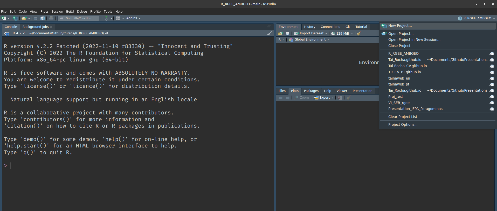
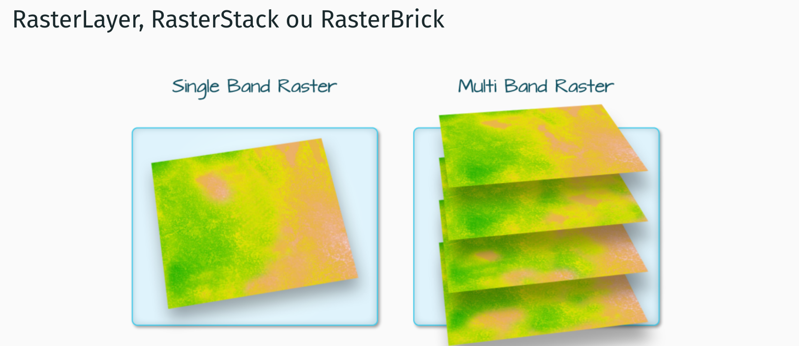
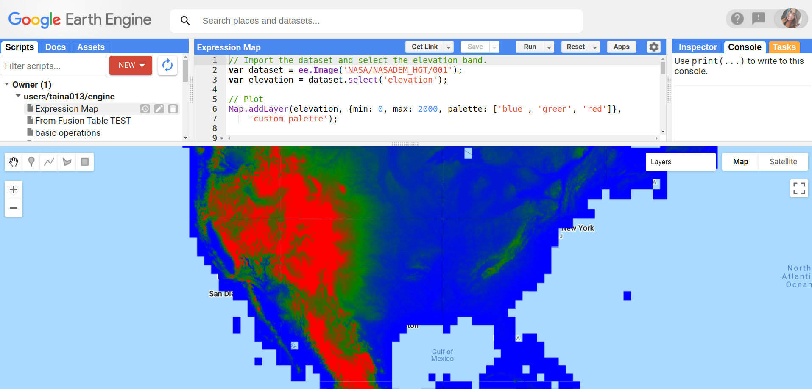

class: title-slide, left, middle
background-image: url("images/Rlogo.png")
background-position: 10% 50%
background-size: 30%
background-color: #F9F8F3

.pull-right[

# `r rmarkdown::metadata$title`
### `r rmarkdown::metadata$date`
### `r rmarkdown::metadata$author`
]

---
## Introdução a linguagem R
.pull-left[
```{r R, echo=FALSE, out.width="72%", fig.align="left"}
knitr::include_graphics("images/Rlogo.png")
```
]

<br>
<br>

### Código aberto

### Estatística | Ciência de dados 

### Comunidade colaborativa e ativa  

---
## Introdução a linguagem R

### IDES para R

```{r Rstudio, echo=FALSE, out.width="65%", fig.align="center"}
knitr::include_graphics("images/Rstudio.png")
```
---
## Instalações 
#### Windows 

1.  Acessar o site oficial [R (4.2.2)](https://www.r-project.org/). 

2. Acessar a opção `Download`.

3. Esoclha o servidor (mirror) mais próximo de você.

4. Clique em Download R for Windows.

5. Clique na opção `base`  ou `install R for the first time` 

6. Na nova página, clique em Download R x.x.x for Windows, sendo x.x.x o número da versão que será baixada. Se você teve algum problema com o download, tente escolher outro servidor

- SO Windows: Altamente recomendável a instalação do [Rtools](https://cran.r-project.org/bin/windows/Rtools/rtools42/rtools.html) 

---
## Instalações 
#### Mac

1. Acessar o site oficial [R (4.2.2)](https://www.r-project.org/). 

2.  Acessar a opção `Download` .

3. Escolha a opção de servidor (mirror) mais próxima de você.

4. Na nova página, clique em Download R for (Mac) OS X.

5. Clique na versão do R que você quer baixar (geralmente queremos baixar a mais recente). O objetivo aqui é baixar um arquivo do tipo “R-x.x.x.pkg”, sendo x.x.x o número da versão que vamos instalar. Se você teve algum problema com o download, tente escolher outro servidor no passo 3.

6. Feito o download, clique duas vezes no arquivo baixado e siga as instruções para instalação.

---
## Instalações
#### Linux (Ubuntu e Linux Mint)

```
# r
sudo apt-key adv --keyserver keyserver.ubuntu.com --recv-keys E298A3A825C0D65DFD57CBB651716619E084DAB9
gpg --keyserver keyserver.ubuntu.com --recv-key E298A3A825C0D65DFD57CBB651716619E084DAB9
gpg -a --export E298A3A825C0D65DFD57CBB651716619E084DAB9 | sudo apt-key add -
sudo add-apt-repository "deb https://cloud.r-project.org/bin/linux/ubuntu focal-cran40/"
sudo apt update
sudo apt install -y r-base r-base-core r-recommended r-base-dev

# r spatial
sudo add-apt-repository ppa:ubuntugis/ubuntugis-unstable
sudo apt update
sudo apt install -y libudunits2-dev libgdal-dev libgeos-dev libproj-dev

# rstudio
wget -c https://download1.rstudio.org/desktop/bionic/amd64/rstudio-2021.09.0%2B351-amd64.deb &&
sudo dpkg -i rstudio-2021.09.0+351-amd64.deb &&
sudo apt install -fy && 
rm rstudio-2021.09.0+351-amd64.deb

```
---
## Instalações 
#### RStudio

1. Acesse a página oficial [RStudio (2022.12.0)](https://posit.co/download/rstudio-desktop/)

2. Clique duas vezes no arquivo que você baixou da página do RStudio e siga as instruções de instalação.

---
## R Gui

```{r Rgui, echo=FALSE, out.width="65%", fig.align="center"}
knitr::include_graphics("images/Rgui.png")
```
---
## Interface Rstudio

<center>Rstudio</center>

```{r Rstudioabas, echo=FALSE, out.width="75%", fig.align="center"}
knitr::include_graphics("images/Rstudioabas.png")
```
<center>Fonte Luis Otávio</center>
---
## Instalando pacotes das práticas. O comando é necessário apenas 1x
```{r pckgs, echo=TRUE, eval=FALSE}

install.packages("dplyr") # manipulação dos dados do tipo  dataframe
install.packages("geojsonio") # Converter dados para 'GeoJSON'
install.packages("ggplot2") # gráficos
install.packages("rgee") # acessar GEE
install.packages("raster")  # manipulação de dados vetoriais e matriciais
install.packages("sf") # manipulação de dados vetoriais
install.packages("tidyr") # manipulação dos dados do tipo  dataframe
```
---
## Carregando os pacotes. Necessário sempre ao iniciar a sessão R/ Rstudio

```{r loadpckgs, echo=TRUE, eval=FALSE}

library(dplyr) 
library(geojsonio) 
library(ggplot2) 
library(rgee) 
library(raster) 
library(sf)  
library(tidyr) 

```

---
## Funcionalidade "Projetos" no Rstudio.
--

#### Menu File -> New Project

```{r Rprojects1, echo=FALSE, out.width="70%", fig.align="center"}

```

---
## Funcionalidade "Projetos" no Rstudio.

#### Canto superior direito -> New Project

```{r Rprojects2, echo=FALSE, out.width="70%", fig.align="center"}

```

---
## Funcionalidade "Projetos" no Rstudio.

#### Selecionar diretório na sua máquina 

```{r Rprojects3, echo=FALSE, out.width="55%", fig.align="center"}
knitr::include_graphics("images/Rprojects_3.png")
```
---
## Funcionalidade "Projetos" no Rstudio.

#### Organização dos diretórios 
.pull-left[
Exemplo 1: 

nome_do_projeto/
  - README.Rmd: Arquivo de texto descrevendo o projeto 
  - R/: Código/scripts R, script_1_installpckgs, script_2loadpckgs
  - data-raw/: Dados brutos 
  - data/: Dados limpos/filtrados/recortados
  - docs/: documentos gerais
  - output/: resultados
  - nome_do_projeto.Rproj
]
<br>
Exemplo 2:

nome_do_projeto/
  - .Rprofile: códigos para rodar assim que abrir o projeto
  - R/: Código R, organizado com a-carrega.R, b-prepara bd.R, c-vis.R, d-modela, ...
  - csv/: Dados em .csv
  - png/: gráficos em PNG
  - nome_do_projeto.Rproj

---
## Dados geoespaciais na linguagem R
.pull-left[
```{r RSpatial, echo=FALSE, out.width="70%", fig.align="center"}
knitr::include_graphics("images/Rlogo.png")
```
]

<br>

.right-col[


<center> Tipos de dados</center> 
<br>
<center>  Principais pacotes</center>
<br>
<center> Operações diversas</center>
<br>
<center> Estudos de casos</center>

]

---
## Dados geoespaciais no R
#### Dados vetoriais

Formas geométricas (ex. pontos, linhas e polígonos) que geralmente possuem tabelas de atributos assoiacos a essas formas. 
.pull-left[
```{r vetor, echo=FALSE, out.width="100%", fig.align="left"}
knitr::include_graphics("images/vetor.png")
```
]
.pull-right[
<br>
<br>
<br>
<br>
Figura disponível no livro [Análises Ecológicas no R](https://analises-ecologicas.com/index.html) 

]
---
## Dados geoespaciais no R
#### Dados matriciais. Conjunto de celulas/pixels (matriz) que apresentam : 
.pull-left[
```{r rasterM, echo=FALSE, out.width="40%", fig.align="left"}

```

]

<br>
<br>
<br>
<br>
<br>
<br>
<br>

Figura disponível no livro [Análises Ecológicas no R](https://analises-ecologicas.com/index.html) 

---
## Dados geoespaciais no R
#### Dados matriciais

```{r cont_cat, echo=FALSE, out.width="55%", fig.align="center"}

```
Lovelace et al., 2020

---
## Dados geoespaciais no R
#### Dados matriciais

```{r classes_raster, echo=FALSE, out.width="70%", fig.align="center"}

```
National Ecological Observatory Network (NEON)
---
## Dados geoespaciais no R
#### Principais pacotes para manipulação de dado geoespacial no R

```{r vetor_pckgs, echo=FALSE, out.width="55%", fig.align="center"}

```

---
## Dados geoespaciais no R
#### Principais pacotes para manipulação de dado geoespacial no R
.pull-left[

]
.pull-right[
<br>
<br>
### Acesso ao Google Earth Engine via R
]
---
## Mãos à obra 

```{r cat, echo=FALSE, out.width="40%", fig.align="center"}
knitr::include_graphics("https://media1.giphy.com/media/JIX9t2j0ZTN9S/giphy.gif?cid=ecf05e47307gd7nm3judswslotpf1tmp6o7ybmvp694f8z01&rid=giphy.gif&ct=g")
```

Parte prática: Script_1_install.R , Scripts_2_vetores.R, Scripts_3_matriz.R
---
## Dados geoespaciais no R

#### rgee: acessando a API do GEE 

```{r url 1, echo=FALSE}
knitr::include_url("https://earthengine.google.com/", height = 450)
```
.footnote[https://developers.google.com/earth-engine/datasets/"]

---
### Infraestrutura do GEE - JavaScript ou Phyton 

--
```{r js_py, echo=FALSE, out.width="70%", fig.align="center"}
knitr::include_graphics("images/js_py.png")
```
---
### Infraestrutura do GEE

Code editor : https://code.earthengine.google.com/
```{r cejs, echo=FALSE, out.width="80%", fig.align="center"}

```

---
class: middle 
background-image: url(images/rgee-hex.png)
background-position: 50% 5%
background-size: 5%


```{r paper, echo=FALSE}
knitr::include_url("https://www.theoj.org/joss-papers/joss.02272/10.21105.joss.02272.pdf", height = 450)

```
---
### Infraestrutura do GEE - JavaScript ou Phyton 
```{r js_py_r, echo=FALSE, out.width="70%", fig.align="center"}
knitr::include_graphics("images/R_option.png")
```
---
#### Funcionamento do rgee
```{r workflow, echo=FALSE, out.width="100%", fig.align='center'}
knitr::include_graphics("images/wf_rgee.png")
```
---
## Mãos à obra 

```{r cat_2, echo=FALSE, out.width="40%", fig.align="center"}
knitr::include_graphics("https://media1.giphy.com/media/JIX9t2j0ZTN9S/giphy.gif?cid=ecf05e47307gd7nm3judswslotpf1tmp6o7ybmvp694f8z01&rid=giphy.gif&ct=g")
```

Parte prática: Script_4_rgee.R, Scrip_5_Estudos_de_caso.R
---
#### Referências

- Aybar, C., Wu, Q., Bautista, L., Yali, R., & Barja, A. (2020). rgee: An R package for interacting with Google Earth Engine. Journal of Open Source Software, 5(51), 2272.

- [Documentação](https://cran.r-project.org/web/packages/rgee/vignettes/rgee01.html)

- [Tutorial](http://www.css.cornell.edu/faculty/dgr2/_static/files/R_html/ex_rgee.html)

- [Repositório](https://github.com/r-spatial/rgee)

- [rgeeExtra](https://r-earthengine.com/rgeeExtra/), extensão para o rgee 

- [rgee examples](https://csaybar.github.io/rgee-examples/)


---
name: hello
class: middle, center, inverse


### `r rmarkdown::metadata$author`


### `r rmarkdown::metadata$role`

### `r rmarkdown::metadata$org`

[`r fontawesome::fa("github")` @Tai-Rocha](https://github.com/Tai-Rocha)    
[`r fontawesome::fa("twitter")` @Tai_Rocha_](https://twitter.com/Tai_Rocha_)   
[`r fontawesome::fa("link")` tainaweb-en.netlify.app](https://tainaweb-en.netlify.app/)